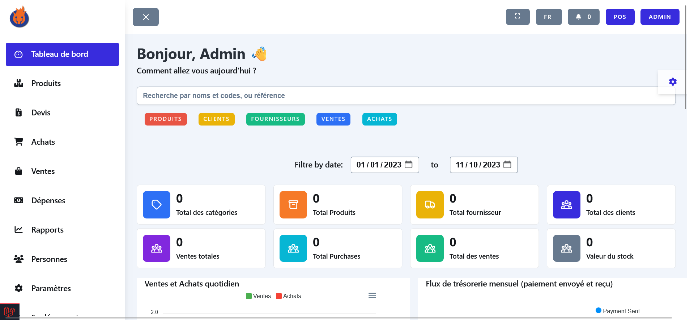
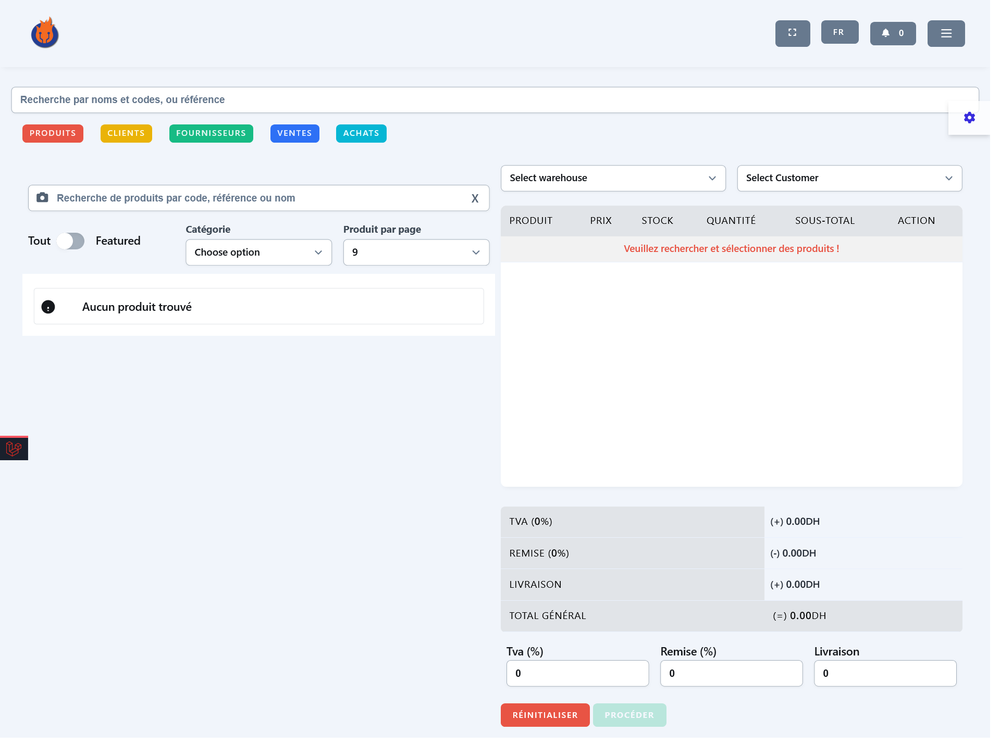
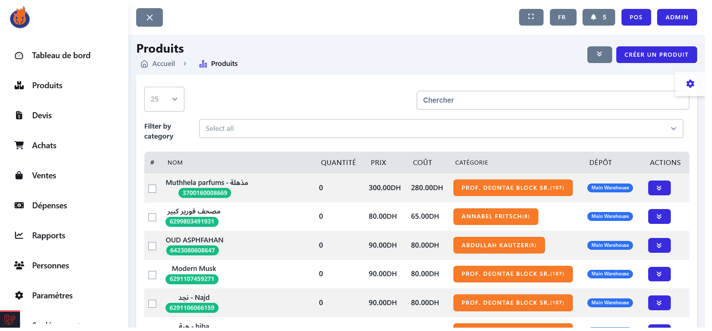
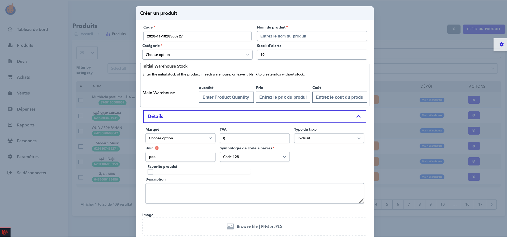
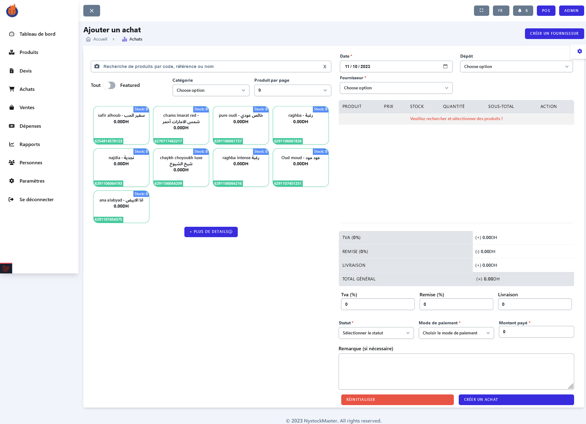
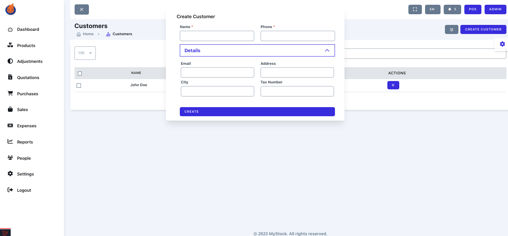

<p align="center"><a href="https://laravel.com" target="_blank"></a></p>

<p align="center">
<a href="https://github.com/laravel/framework/actions"></a>
<a href="https://packagist.org/packages/laravel/framework"></a>
<a href="https://packagist.org/packages/laravel/framework"></a>
<a href="https://packagist.org/packages/laravel/framework"></a>
</p>

## Author 

Welcome to a unique project that goes beyond the ordinary. I bring to you MystockMaster, a solution born out of my experience in the retail and ecommerce sectors, particularly in electronics such as PCs and smartphones. My continuous vigilance over critical aspects like user-friendliness and robustness aims to position us as the best in the open-source web apps category.

I extend heartfelt gratitude to the Laravel community for their contributions, which have been a source of immense learning. Now, it's my turn to contribute and give back.

(✌) سلام

## Overview 

MystockMaster, a Laravel-based inventory management system, simplifies the tracking of your inventory, sales, purchases, and more. Offering a user-friendly dashboard, intuitive reports, and an array of features, it becomes your partner in efficient business management and growth.

Features:
- Dashboard with key insights and metrics
- Products, categories, brands, and suppliers management
- Sales and purchases tracking
- Customers and user management with roles and permissions
- Settings and preferences
- Inventory adjustment and stock management
- Multi-currency support
- Warehouses multi-locations
- Local and cloud-based backup options
- Import/Export functionality
- Multi-language support
- POS integration
- Notifications and alerts
- Send product promotions to Telegram
    and more...

Built with Laravel 9, Livewire, AlpineJs, and Tailwind CSS, ensuring a fast and responsive user experience. Try it out today and witness how it streamlines inventory management, propelling your business forward.


## Login with the following credentials
    -   Email: `admin@gmail.com`
    -   Password: `password`

## Requirements

-   PHP >= 8.0 (or higher)
-   Composer
-   Node.js
-   NPM
-   MySQL

## Installation

1.  Clone the repository
2.  Run `composer install`
3.  Run `npm install`
4.  Run `npm run dev`
5.  Create a database and update the `.env` file
6.  Run `php artisan migrate --seed`
7.  run `php artisan key:generate`
8.  Run `php artisan serve`
9.  Login with the following credentials
    -   Email: `admin@gmail.com`
    -   Password: `password`
10.  Enjoy!

## License

The Laravel framework is open-sourced software licensed under the [MIT license](https://opensource.org/licenses/MIT).

## Credits

-   [Laravel](https://laravel.com/)
-   [Tailwind CSS](https://tailwindcss.com/)
-   [Livewire](https://laravel-livewire.com/)
-   [AlpineJs]()

## Screenshots : 

| Login | Dashboard | POS |
| --- | --- | --- |
|  |  |  |

| Products | Product Create | Purchase Create |
| --- | --- | --- |
|  |  |  |

| Sale Create | Customer Create |
| --- | --- |
|  |  |

## Contact

-   [Twitter](https://twitter.com/cpdrenato)
-   [LinkedIn](https://www.linkedin.com/in/renato-lucena-33777133/)
-   [GitHub](https://www.github.com/lucenarenato/)


## Requisitos Docker

- Docker instalado e em execução
- Docker Compose v2 (comando `docker compose`)

Verifique:

```bash
docker --version
docker compose version
```

Crie o arquivo de ambiente:

```bash
cp .env.example .env
```

Suba os containers:

```bash
docker compose up -d --build
```

Instale as dependencias do PHP:

```bash
docker compose exec fpm composer install
```

Gere a chave da aplicacao:

```bash
docker compose exec fpm php artisan key:generate
```

 Rode as migrations:

```bash
docker compose exec fpm php artisan migrate
```
(Opcional) Rode seeders:

```bash
docker compose exec fpm php artisan db:seed
```

Acessos locais

- API/Nginx: `http://localhost`
- PhpMyAdmin: `http://localhost:8082`
- Mailpit: `http://localhost:8025`

Se voce alterou portas no `.env`, use os valores configurados nele.

## Comandos uteis

Subir ambiente:

```bash
docker compose up -d
```

Rebuild completo:

```bash
docker compose up -d --build --force-recreate
```

Se voce alterou algum Dockerfile (ex.: `.docker/fpm/Dockerfile`), rode rebuild da imagem antes de executar comandos dentro do container:

```bash
docker compose build fpm
docker compose up -d fpm
```

Acompanhar logs:

```bash
docker compose logs -f
```

Parar ambiente:

```bash
docker compose stop
```

Derrubar ambiente:

```bash
docker compose down
```

Derrubar removendo orfaos:

```bash
docker compose down --remove-orphans
```

## Solucao de problemas

### Erro `KeyError: 'ContainerConfig'` ou `KeyError: 'id'`

Esse erro ocorre ao usar o `docker-compose` antigo (v1). Use sempre Compose v2:

```bash
docker compose up -d --build
```

Se necessario, remova o binario legado:

```bash
sudo apt-get remove -y docker-compose
sudo apt-get install -y docker-compose-plugin
```

### Ambiente inconsistente apos mudancas

```bash
docker compose down --remove-orphans
docker compose up -d --build --force-recreate
```

### Erro ao subir arquivo: `Unable to create a directory at /var/www/html/storage/app/public/...`

Se o upload falhar por permissao no `storage`, ajuste dono e permissoes:

```bash
sudo chown -R renato:renato /home/renato/code/suit-members-api #altere o user com seu nome
docker compose exec fpm chown -R www-data:www-data storage bootstrap/cache
docker compose exec fpm find storage bootstrap/cache -type d -exec chmod 775 {} \;
docker compose exec fpm find storage bootstrap/cache -type f -exec chmod 664 {} \;
```

Opcionalmente, valide escrita como usuario do PHP-FPM:

```bash
docker compose exec -u www-data fpm sh -lc 'mkdir -p storage/app/public/banners && test -w storage/app/public/banners && echo OK_WRITE'
```

### Erro no login com `Erro do servidor`

Se o login falhar e o ambiente tiver sido recriado do zero, o Passport pode estar sem chaves ou sem personal access client.

Rode:

```bash
docker compose exec fpm php artisan passport:keys --force
docker compose exec fpm php artisan passport:client --personal --name="Suit Members Personal Access Client" --no-interaction
```

Em seguida, corrija as permissoes das chaves (o `passport:keys` as cria como `root`, mas o PHP-FPM roda como `www-data`):

```bash
docker compose exec fpm chown www-data:www-data storage/oauth-private.key storage/oauth-public.key
```

Isso costuma ser necessario depois de `migrate:fresh --seed`.

## Sanity check

Depois do setup, valide o ambiente com este fluxo minimo:

1. Recrie banco e seeders:

```bash
docker compose exec fpm php artisan migrate:fresh --seed
```

2. Gere as chaves e o client do Passport:

```bash
docker compose exec fpm php artisan passport:keys --force
docker compose exec fpm chown www-data:www-data storage/oauth-private.key storage/oauth-public.key
docker compose exec fpm php artisan passport:client --personal --name="Suit Members Personal Access Client" --no-interaction
```

3. Verifique os servicos auxiliares:

- PhpMyAdmin em `http://localhost:8082`
- Mailpit em `http://localhost:8025`
- Redis respondendo no container `suit_members_redis`
